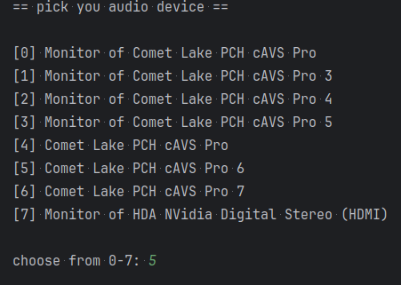
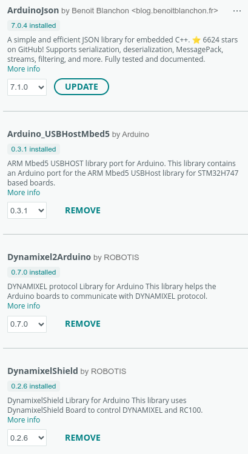

# Blossom

Blossom is an open-hardware, open-source tensile robot that you can handcraft and accessorize to your liking. You can read more about the project in the [ACM T-HRI Paper](https://doi.org/10.1145/3310356) and in [Evan Ackerman's IEEE Spectrum article](https://spectrum.ieee.org/automaton/robotics/home-robots/blossom-a-creative-handmade-approach-to-social-robotics-from-cornell-and-google).

Here are some examples of Blossom robots:


 


----

# Blossom How-To

#### if stuck: [original CMU wiki](https://github.com/hrc2/blossom-public/wiki)

## [Setup Guide](./Setup_Guide.md)
for more experience users:
```bash
git clone https://github.com/agmui/blossom-public/tree/master
pip install -r reqirments.txt
```

### API key

To use the chatbot you will have to pay for a key from OpenAI

you key will look like this:
```env
OPENAI_API_KEY=sk-xxxxxxxxxxxxxxxxxxxxxxxxxxxxxxxxxxxxxxxxxxxxxxxxxxxxx
```

_if you are taking a class at RHIT ask Dr. Berry for the API key_
> **NOTE:** DO NOT SHARE THE API KEY OR PUSH THE `.env` FILE

create a file called `.env` and paste your key inside

## Building Blossom

To build your own Blossom, check out the [Build Guide](https://github.com/hrc2/blossom-public/wiki). The rest of this document will teach you how to set up the software to run the robot.

> **Note**
> You need to have the basic software set up as listed above to build Blossom


## Running Blossom 

### Gesture recogniser

run:
```bash
python main.py
```
> _Common Error on Mac:_ `could not open port.`
> 
> You may need to run `sudo chmod 777 <the name of the port>.`
>
> Ex: `sudo chmod 777 /dev/ttyACM0`

a window should pop up running the gesture recogniser

for the chatbot demo run
```bash
python chatbot_pipeline.py
```
then when asked input your mic, for me it was 5:


#### Project files
* main.py
  * the entry point to the gesture recogniser program
  * the function `on_detection()` is where most of you code should go
    it gets called anytime a gesture gets recognised
* utils.py
  * helpful functions for starting the robot and gesture recogniser
  * use the function `list_camera_ports()` to get which camera port OpenCV will use
* chatbot_pipline.py
  * chatGPT chatbot pipeline
  * to run: `python chatbot_pipeline.py` for a demo
  * use the function `list_audio_devices()` to get which mic you will use
  * to run the whole pipeline:
  ```python
    # input selected audio device index
    cb = ChatBot(mic_index=MIC_INDEX)

    # run the chatbot
    cb.run_pipline()
  ```
  * it will generate speech.mp3 and test.wav everytime it is run. It is used
    to comunicate with the openAI API
* motor_calib.py
  * used for calibrating the motors when initially building the robot
* start.py
  * class that holds all the robot code


### Command Line Interface(CLI)
To start the CLI, plug Blossom in and run
```bash
python start.py 
```
_Error:_ could not open port. You may need to run `sudo chmod 777 <the name of the port>.` 
Ex: `sudo chmod 777 /dev/ttyACM0`


Additional flags:
```
-b do not start up Web UI
-p denote the port
-i specify an IP address (won't work with localhost)
```
_Linux may default to a loopback IP (`127.0.1.1`); in this case you **must** specify the IP address using `-i`._

For example, to make Blossom nod with the `yes` sequence, type: 

`s` -> Enter -> `yes`

Available commands:
- `l`: list available sequences
- `s`: perform a sequence, followed by the Enter key and the sequence name
- To perform an idler (looped gesture), enter two sequence names separated by `=`, e.g. `s` -> Enter -> `yes=no` (play `yes` then loop `no` indefinitely until another sequence is played).  
- `q`: quit

## [Blossom Arduino](blossom_arduino)

Arduino Giga R1 implementation using the Dynamixel shield for blossom

> Note: this project is not fully finished so there are some missing parts to
> the arduino implementation

### Setup

In the Arduino IDE click on: Tools -> Board -> Boards Manager...

then type Arduino Giga in the search
and download the one called Arduino Mbed OS GIGA Boards

Next you need to download these libs:



the entry point is in [bloosom.ino](blossom_arduino/arduino_src/bloosom/bloosom.ino)
