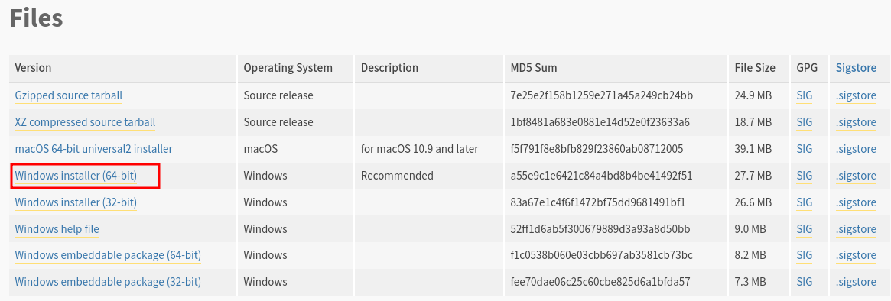
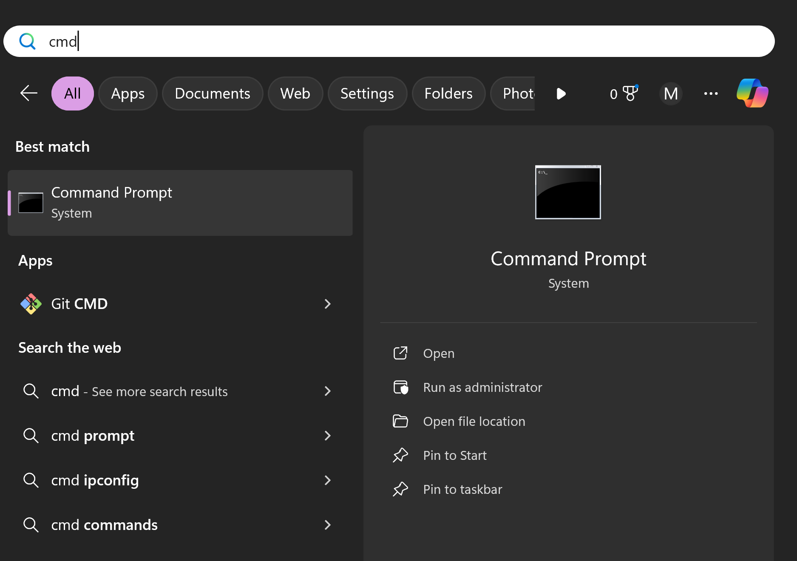

# Blossom

Blossom is an open-hardware, open-source tensile robot that you can handcraft and accessorize to your liking. You can read more about the project in the [ACM T-HRI Paper](https://doi.org/10.1145/3310356) and in [Evan Ackerman's IEEE Spectrum article](https://spectrum.ieee.org/automaton/robotics/home-robots/blossom-a-creative-handmade-approach-to-social-robotics-from-cornell-and-google).

Here are some examples of Blossom robots:


 


----

# Blossom How-To

### [original CMU wiki](https://github.com/hrc2/blossom-public/wiki)

## Get repo
In a terminal, clone this repo
```
git clone https://github.com/agmui/blossom-public.git
```

## Setup Software Dependencies

Make sure you're using [Python `3`]
To check, run `python -V` or `python3 -V`in the terminal to check the version. As of now, this codebase was tested and works on `Python 3.5.2` on Ubuntu 16.04 and Mac.
_The following steps will assume `python -V` reports with version `>3.x.x`. If it reports `2.x.x` then replace `python` in the following steps with `python3`_

Also ensure that [`pip3` is installed](https://pip.pypa.io/en/stable/installing/).
To install:\
Ubuntu: `sudo apt install python3-pip`\
Mac: `curl https://bootstrap.pypa.io/get-pip.py -o get-pip.py`, then `python3 get-pip.py`

Virtual environments (`venv`) should be installed, but if not:\
Ubuntu: `sudo apt-get install python3-venv`\
Mac: `brew install python3-venv`

Make a `venv` (virtual environment) in the top `blossom` directory and activate it:
```
python -m venv blossom_venv
source blossom_venv/bin/activate
```

### General Setup


### Windows 
Install python3: [Windows python installer link](https://www.python.org/downloads/release/python-31011/)

scroll down to find the installer:


Type `cmd` in the windows search bar to open the command line:


go to where you cloned the repo:
```bash
cd blossom/project/root
```

install the required python pakages:
```bash
pip install -r requirements.txt
```


### Mac 

First install python3:
```bash
/bin/bash -c "$(curl -fsSL https://raw.githubusercontent.com/Homebrew/install/master/install.sh)"
export PATH="/usr/local/opt/python/libexec/bin:$PATH"
brew install python
```

Then install the required python pakages 
```
pip install -r requirements.txt --user
```
> _If this still doesn't work, you may have to append `sudo` before `pip`:_
> ```
> sudo pip install -r requirements.txt --user
> ```
_This may require you to run in `sudo` for subsequent steps._

_It may take a while to install the dependencies; you may want to run `pip` verbose to make sure that it's still downloading: `pip install -rv requirements.txt`_

_If you run into an error opening a port, try changing Blossom's permissions: `sudo chmod 777 /dev/ttyACM0`.
Alternatively, rerun everything with admin privileges._

_If you're using OSX and getting strange errors, try:_
```
sudo chown -R $USER /Library/Python/3.5
```


#### Linux 🐧
First install python for your specific distro: (for ubuntu that is: `sudp apt install python3`)

_Ubuntu_: You may need to run 
```
sudo apt-get install build-essential libssl-dev libffi-dev python3-dev  
``` 
and
```
pip install wheel
```

To install dependencies, run in the main `blossom` directory:
```
pip install -r requirements.txt
```

_If this still doesn't work, you may have to append `sudo` before `pip`:_
```
sudo pip install -r requirements.txt 
```
_This may require you to run in `sudo` for subsequent steps._

_It may take a while to install the dependencies;
you may want to run `pip` verbose to make sure that it's still downloading: `pip install -rv requirements.txt`_

_If you run into an error opening a port, try changing Blossom's permissions: `sudo chmod 777 /dev/ttyACM0`. Alternatively, rerun everything with admin privileges._

_Installation will take longer on a Raspberry Pi, and you may need additional dependencies:_
```
sudo apt-get install xvfb
```

### API key
If you want to use the chatbot you will need to create a .env file with the API key:
```env
OPENAI_API_KEY=sk-xxxxxxxxxxxxxxxxxxxxxxxxxxxxxxxxxxxxxxxxxxxxxxxxxxxxx
```
_if you are taking a class at RHIT ask Dr. Berry for the API key_
> **NOTE:** DO NOT SHARE THE API KEY OR PUSH THE `.env` FILE

## Building Blossom

To build your own Blossom, check out the [Build Guide](https://github.com/hrc2/blossom-public/wiki). The rest of this document will teach you how to set up the software to run the robot.

> **Note**
> You need to have the basic software set up as listed above to build Blossom_


## Running Blossom 

### Gesture recogniser

first run 
```python
from utils import list_camera_ports
from chatbot_pipline import list_audio_devices

list_camera_ports()
list_audio_devices()
```
to get the camera and mic you want to use for the gesture recogniser and chatbot

then set:
```python
CAMERA_INDEX = 
MIC_INDEX =  
```
in `main.py` to what you choose


then run:
```bash
python main.py
```
> _Error:_ could not open port.
> 
> You may need to run `sudo chmod 777 <the name of the port>.`
>
> Ex: `sudo chmod 777 /dev/ttyACM0`

a window should pop up running the gesture recogniser

#### Project files
* main.py
  * the entry point to the gesture recogniser program
  * the function `on_detection()` is where most of you code should go
    it gets called anytime a gesture gets recognised
* utils.py
  * helpful functions for starting the robot and gesture recogniser
  * use the function `list_camera_ports()` to get which camera port OpenCV will use
* chatbot_pipline.py
  * chatGPT chatbot pipeline
  * to run: `python chatbot_pipeline.py` for a demo
  * use the function `list_audio_devices()` to get which mic you will use
  * to run the whole pipeline:
  ```python
    # input selected audio device index
    cb = ChatBot(mic_index=MIC_INDEX)

    # run the chatbot
    cb.run_pipline()
  ```
  * it will generate speech.mp3 and test.wav everytime it is run. It is used
    to comunicate with the openAI API
* motor_calib.py
  * used for calibrating the motors when initially building the robot
* start.py
  * class that holds all the robot code


### Command Line Interface(CLI)
To start the CLI, plug Blossom in and run
```bash
python start.py 
```
_Error:_ could not open port. You may need to run `sudo chmod 777 <the name of the port>.` 
Ex: `sudo chmod 777 /dev/ttyACM0`


Additional flags:
```
-b do not start up Web UI
-p denote the port
-i specify an IP address (won't work with localhost)
```
_Linux may default to a loopback IP (`127.0.1.1`); in this case you **must** specify the IP address using `-i`._

For example, to make Blossom nod with the `yes` sequence, type: 

`s` -> Enter -> `yes`

Available commands:
- `l`: list available sequences
- `s`: perform a sequence, followed by the Enter key and the sequence name
- To perform an idler (looped gesture), enter two sequence names separated by `=`, e.g. `s` -> Enter -> `yes=no` (play `yes` then loop `no` indefinitely until another sequence is played).  
- `q`: quit

## [Blossom Arduino](blossom_arduino)

Arduino Giga R1 implementation using the Dynamixel shield for blossom

### Setup

In the Arduino IDE click on: Tools -> Board -> Boards Manager...

then type Arduino Giga in the search
and download the one called Arduino Mbed OS GIGA Boards

Next you need to download these libs:


the entry point is in [bloosom.ino](blossom_arduino/arduino_src/bloosom/bloosom.ino)
